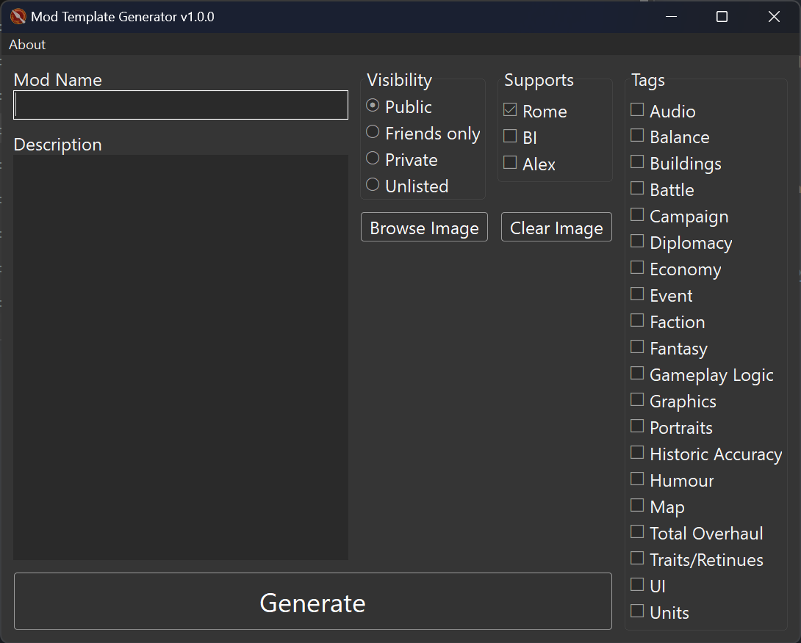

# Mod Template Generator

A graphical tool to generate a mod folder template for _Total War: Rome Remastered_. The tool will generate the `modinfo.json` file and (optionally) accept a preview image.

## Download

Visit the [**Releases**](https://github.com/vhaghverdi/mod-template-generator/releases) page to download the latest package.

## Usage

1. Enter your mod's name.
2. Enter its description.
3. Select visibility on the Steam Workshop.
4. Select which engines it supports.
5. Select relevant tags.
6. Optionally browse for an image.

---

Brought to you by the EB Online Team
